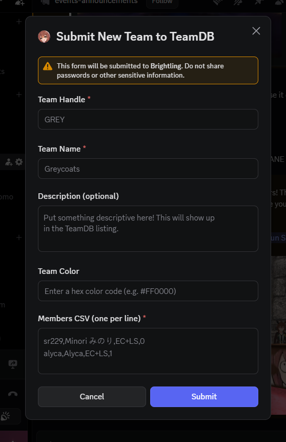

# Brightling Team Registration Guide

Welcome to the URS Team Database! The easiest way to register your team is through our Discord bot, **Brightling**. This guide will walk you through the process of using the submission form.



## Accessing the Form

To start the registration process, use the designated command in our Discord server. This will open the "Submit New Team to TeamDB" modal shown above.

## Form Fields

### 1. Team Handle
*   **Description:** A unique shorthand identifier for your team.
*   **Requirements:** 2-4 characters, ASCII only (e.g., `GREY`, `EXM1`).

### 2. Team Name
*   **Description:** The full, official name of your team.
*   **Requirements:** Maximum 64 characters.

### 3. Description (Optional)
*   **Description:** A short blurb about your team that will appear in the TeamDB listing.
*   **Requirements:** Maximum 256 characters.

### 4. Team Color
*   **Description:** The primary color for your team, used for icons and backgrounds.
*   **Requirements:** Must be a hex color code (e.g., `#FF0000` for red, `#9E9E9E` for grey).

### 5. Members CSV (one per line)
*   **Description:** A list of your team members and their details.
*   **Format:** `discord_name,vrc_name,runstyle,role`
*   **Important:** Do NOT include the header row in the bot's text area.

#### Field Details for CSV:
*   **discord_name:** The member's Discord username (lowercase).
*   **vrc_name:** The member's VRChat username.
*   **runstyle:** Use the following shorthands:
    *   `FR`: Front-running
    *   `PC`: Pace-chasing
    *   `LS`: Late-surging
    *   `EC`: End-closing
    *   *Note: For multiple styles, separate with a plus (e.g., `EC+LS`).*
*   **role:** Use the corresponding ID:
    *   `0`: Captain
    *   `1`: Co-Captain
    *   `2`: Trainer
    *   `3`: Regular Member
    *   `4`: Temporary Member

**Example Entry:**
```csv
sr229,Minori みのり,EC+LS,0
alyca,Alyca,EC+LS,1
```

---

## What Happens Next?

Once you click **Submit**, Brightling will validate your data. If everything is correct, your team will be added to the database. If there are errors, the bot will provide feedback on what needs to be fixed.

If you have any questions or need assistance, please reach out to the UmaOps team in the Discord server.
